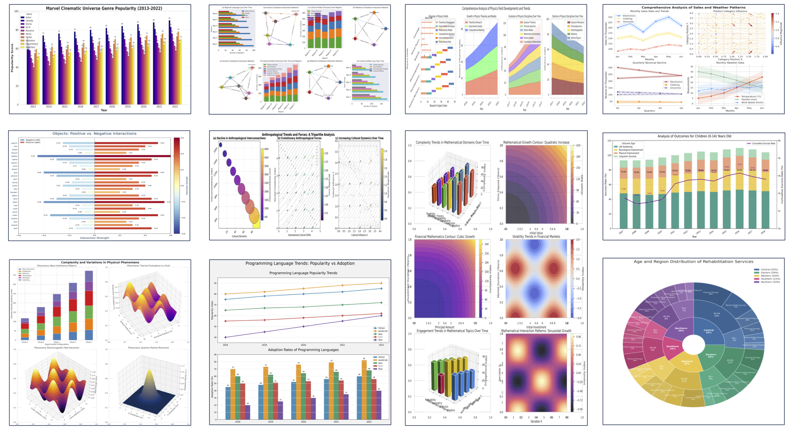
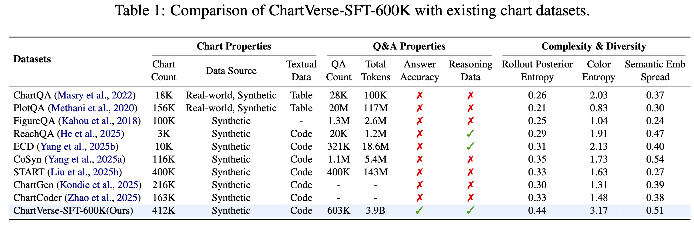
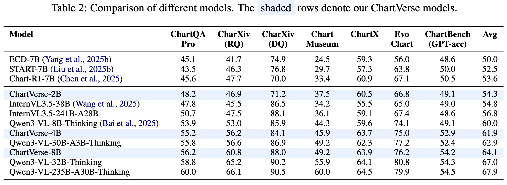

<div align="center">

# ChartVerse: Scaling Chart Reasoning via Reliable Programmatic Synthesis from Scratch

</div>

<div align="center">
  <strong>
    Zheng Liu<sup>1,4*</sup>, Honglin Lin<sup>2,4*</sup>, Chonghan Qin<sup>3,4</sup>, Xiaoyang Wang<sup>4</sup>, Xin Gao<sup>4</sup>, Yu Li<sup>4</sup>,
    <br>
    Mengzhang Cai<sup>4</sup>, Yun Zhu<sup>4</sup>, Zhanping Zhong<sup>4</sup>, Qizhi Pei<sup>4</sup>, Zhuoshi Pan<sup>4</sup>, Xiaoran Shang<sup>4</sup>,
    <br>
    Bin Cui<sup>1</sup>, Conghui He<sup>4</sup>, Wentao Zhang<sup>1✉</sup>, Lijun Wu<sup>4✉</sup>
  </strong>
  <br><br>
  <sup>1</sup>Peking University, <sup>2</sup>Shanghai Jiao Tong University, <sup>3</sup>The University of Hong Kong,
  <br>
  <sup>4</sup>Shanghai Artificial Intelligence Laboratory
  <br><br>
  <sub>* Equal contribution &nbsp;&nbsp; ✉ Corresponding author</sub>
</div>

<br>

<div align="center">
  <a href="https://arxiv.org/abs/2601.13606" target="_blank">
      
  </a>
  <a href="https://github.com/YOUR_USERNAME/ChartVerse" target="_blank">
      
  </a>
  <a href="https://huggingface.co/collections/opendatalab/chartverse" target="_blank">
      
  </a>
  <a href="https://chartverse.github.io" target="_blank">
      
  </a>
</div>

<br>
<div align="center">
  
</div>

## 🔥 News
* **[2026-01-27]**: 🚀 Our ChartVerse-SFT-1800K dataset ranked **Top 8 on Hugging Face Datasets Trending (Top 1 on Image Text Filed)**.   
* **[2026-01-07]** 🚀 **Project Launch:** The full **ChartVerse ecosystem** is now available, including the **paper**, **Complexity-Aware Chart Coder**, **models** (2B/4B/8B), and **datasets** (SFT-600K & RL-40K).

* **[2026-01-07]** 🏆 **SOTA Performance:** **ChartVerse-8B** achieves **64.1%** average score on 6 benchmarks, surpassing its teacher **Qwen3-VL-30B-Thinking** (62.9%) and approaching **Qwen3-32B** (67.0%). **ChartVerse-4B** (61.9%) significantly outperforms **Qwen3-VL-8B-Thinking** (60.0%).

## 📖 Abstract


Chart reasoning is a critical capability for Vision Language Models (VLMs). However, the development of open-source models is severely hindered by the lack of high-quality training data. Existing datasets suffer from a dual challenge: synthetic charts are often simplistic and repetitive, while the associated QA pairs are prone to hallucinations and lack the reasoning depth required for complex tasks.
To bridge this gap, we propose **ChartVerse**, a scalable framework designed to synthesize complex charts and reliable reasoning data from scratch. (1) To address the bottleneck of simple patterns, we first introduce **Rollout Posterior Entropy (RPE)**, a novel metric that quantifies chart complexity. Guided by RPE, we develop **complexity-aware chart coder** to autonomously synthesize diverse, high-complexity charts via executable programs. (2) To guarantee reasoning rigor, we develop **truth-anchored inverse QA synthesis**. Diverging from standard generation, we adopt an answer-first paradigm: we extract deterministic answers directly from the source code, generate questions conditional on these anchors, and enforce strict consistency verification. To further elevate difficulty and reasoning depth, we filter samples based on model fail-rate and distill high-quality Chain-of-Thought (CoT) reasoning.
We curate ChartVerse-SFT-600K and ChartVerse-RL-40K using Qwen3-VL-30B-A3B-Thinking as the teacher. Experimental results demonstrate that ChartVerse-8B achieves state-of-the-art performance, notably surpassing its teacher and rivaling the stronger Qwen3-VL-32B-Thinking.

## ⚡ Method Highlights

<div align="center">
  
</div>
<div align="center">
  
</div>

### 1. Metric: Rollout Posterior Entropy (RPE)

Visual density does not always equal difficulty. We propose **Rollout Posterior Entropy (RPE)** to quantify the intrinsic complexity of a chart via **generative stability**.


We quantify complexity through a mathematical pipeline:


* **🔄 VLM Rollout:** Given a chart, we prompt a VLM to generate executable code 8 times. Simple charts yield consistent codes, while complex ones lead to divergence.

* **🧮 Spectral Entropy:** We extract features using CLIP to form a Gram matrix $G$. We **normalize its singular values** to obtain a probability distribution $p_i$, and compute the entropy as:

$$RPE = \frac{-\sum p_i \log p_i}{K}$$

* **🛡️ Difficulty Filter:** We strictly retain samples with **$RPE \ge 0.4$**, ensuring our model learns solely from challenging patterns that test the limits of modern VLMs.


### 2. Complexity-Aware Chart Coder

We train a specialized coder to autonomously synthesize diverse, high-complexity charts from scratch.


* **❄️ Cold Start Construction:** We curate a seed dataset $\mathcal{C}_{cold}$ by filtering real-world charts with high RPE and inferring their code using **Claude-4-Sonnet**.

* **🔄 Iterative Self-Enhancement:** We use the **previous round's coder** to generate large-scale candidates using high-temperature sampling. We filter these by **High Complexity** and **Low Similarity** to train the **next round's coder**, progressively mastering complex visualizations.


### 3. Truth-Anchored Inverse QA Pipeline

#### Phase I: Inverse Logic Construction

We explicitly synthesize the logic chain using **Qwen3-30B-A3B-Thinking** (Text-only) based on the code ground truth:

1. **Script Generation ($S$):** We prompt **Qwen3-30B-A3B-Thinking** to analyze the chart code and generate a Python script $S$ that performs meaningful operations on the data, outputting a deterministic value $A_{py}$.

2. **Reverse Question Synthesis:** We prompt **Qwen3-30B-A3B-Thinking** to generate a question $Q$ that strictly leads to the logic of script $S$.

3. **Consistency Check:** We prompt **Qwen3-30B-A3B-Thinking** to infer the answer $\hat{A}$ using only the code and question $Q$. We strictly retain samples where the inferred answer $\hat{A}$ matches the execution result $A_{py}$.

#### Phase II: CoT Distillation & Difficulty Filtration

To ensure the data is visually challenging for VLMs:

* **CoT Distillation:** We employ **Qwen3-VL-30B-A3B-Thinking** (VLM) to generate Chain-of-Thought (CoT) reasoning traces for the verified pairs.

* **Failure Rate Filtering:** We calculate the failure rate $r(Q)$ over multiple rollouts. We retain "hard but solvable" samples where **$0 < r(Q) < 1$**, discarding trivial or impossible cases.

## 💾 Datasets

### 📥 Download Datasets

Our synthesis pipeline produced two high-quality datasets available on HuggingFace:

| Dataset Name | Scale | Composition | Download |
| :--- | :---: | :--- | :---: |
| **ChartVerse-SFT-1800K** | **1800K** | High-Complexity Charts + CoT Reasoning | [🤗 Download](https://huggingface.co/datasets/opendatalab/ChartVerse-SFT-1800K) |
| **ChartVerse-SFT-600K** | **600K** | High-Complexity Charts + CoT Reasoning | [🤗 Download](https://huggingface.co/datasets/opendatalab/ChartVerse-SFT-600K) |
| **ChartVerse-RL-40K** | **40K** | Hard Reasoning Samples | [🤗 Download](https://huggingface.co/datasets/opendatalab/ChartVerse-RL-40K) |

### 🆚 Comparison with Existing Datasets

We compare **ChartVerse-SFT-600K** with mainstream chart reasoning datasets. As shown below, ChartVerse achieves superior diversity and complexity while ensuring reasoning rigor.

<div align="center">
  
</div>

**Key Advantages:**
* **Higher Complexity (RPE):** Our dataset achieves the highest **Rollout Posterior Entropy (0.44)** compared to baselines (e.g., CoSyn 0.35, ChartQA 0.26), proving that our charts possess greater intrinsic structural difficulty.
* **Superior Diversity:** ChartVerse records the highest **Color Entropy (3.17)** and **Semantic Embedding Spread (0.51)**, indicating a much broader coverage of visual styles and chart topics than previous synthetic engines.
* **Rigorous Reliability:** Unlike datasets reliant on raw LLM generation (which suffer from hallucinations), ChartVerse guarantees **Answer Accuracy** through our *Truth-Anchored Inverse QA* pipeline, backed by **3.9B** tokens of high-quality Chain-of-Thought reasoning data.

## 🦁 Model Zoo & Performance

We release the **Complexity-Aware Chart Coder** and the full **ChartVerse Reasoning Model Series** (including SFT and RL aligned versions).

### 📥 Download Models

| Model Name | Type | Base Model | Param | Avg Score | HuggingFace Link |
| :--- | :--- | :--- | :---: | :---: | :---: |
| **Complexity-Aware Chart Coder** | Coder | Qwen2.5-Coder | 7B | - | [🤗 Download](https://huggingface.co/opendatalab/ChartVerse-Coder) |
| **ChartVerse-2B** | VLM | Qwen3-VL-2B-Instruct | 2B | **54.3** | [🤗 Download](https://huggingface.co/opendatalab/ChartVerse-2B) |
| **ChartVerse-4B-SFT** | VLM | Qwen3-VL-4B-Instruct | 4B | **61.9** | [🤗 Download](https://huggingface.co/opendatalab/ChartVerse-4B) |
| **ChartVerse-8B-SFT** | VLM | Qwen3-VL-8B-Instruct | 8B | **64.1** | [🤗 Download](https://huggingface.co/opendatalab/ChartVerse-8B) |

### 🏆 Detailed Performance

We evaluate ChartVerse on 6 benchmarks requiring complex chart understanding and reasoning. The results demonstrate that **data quality triumphs over model scale**.

<div align="center">
  
</div>

**Key Findings:**
* **Small > Large:** Despite having half the parameters, **ChartVerse-4B** significantly outperforms **Qwen3-VL-8B-Thinking**.
* **Student > Teacher:** **ChartVerse-8B** breaks the distillation ceiling, surpassing its teacher model, **Qwen3-VL-30B-Thinking.
* **Top-Tier Performance:** Our 8B model rivals the performance of the much larger **Qwen3-VL-32B-Thinking**, proving the effectiveness of our pipeline.

## 🚂 Training

We provide comprehensive training scripts in the `training/` directory. Our pipeline is built on **[Llama-Factory](https://github.com/hiyouga/LLaMA-Factory)** for Supervised Fine-Tuning (SFT) and **[veRL](https://github.com/volcengine/verl)** for Reinforcement Learning (RL).

Please ensure you have downloaded the corresponding datasets ([SFT](https://huggingface.co/datasets/ChartVerse-SFT-600k) / [RL](https://huggingface.co/datasets/ChartVerse-RL-40k)) and configured the environments before running the scripts.

| Model Size | Stage | Framework | Script Path |
| :---: | :---: | :--- | :--- |
| **2B** | SFT | Llama-Factory | [`training/chartverse-sft-2b.yaml`](training/chartverse-sft-2b.yaml) |
| **4B** | SFT | Llama-Factory | [`training/chartverse-sft-4b.sh`](training/chartverse-sft-4b.yaml) |
| **8B** | SFT | Llama-Factory | [`training/chartverse-sft-8b.yaml`](training/chartverse-sft-8b.yaml) |
| **2B** | RL | veRL | [`training/chartverse-rl-2b.sh`](training/chartverse-rl-2b.sh) |
| **4B** | RL | veRL | [`training/chartverse-rl-4b.sh`](training/chartverse-rl-4b.sh) |
| **8B** | RL | veRL | [`training/chartverse-rl-8b.sh`](training/chartverse-rl-8b.sh) |

## ⚖️ Evaluation

We provide detailed evaluation scripts in the `eval/` directory. Our evaluation pipeline leverages [VLMEvalKit](https://github.com/open-compass/VLMEvalKit) for the overall framework and [Compass-Verifier](https://github.com/open-compass/CompassVerifier) for rigorous LLM-as-a-Judge assessment. Our implementation ensures that metrics align closely with the official Qwen3-VL results reported in the paper. Please refer to [eval/evaluation.md](eval/evaluation.md) for detailed instructions.

## 🛠️ Quick Start

Since ChartVerse models are initialized from **Qwen3-VL**, usage is straightforward with the `transformers` library.

```python
from transformers import Qwen3VLForConditionalGeneration, AutoTokenizer, AutoProcessor
from PIL import Image
import torch

# 1. Load Model
model_path = "opendatalab/ChartVerse-8B"
model = Qwen3VLForConditionalGeneration.from_pretrained(
    model_path, torch_dtype="auto", device_map="auto"
)
processor = AutoProcessor.from_pretrained(model_path)

# 2. Prepare Input
image_path = "assets/demo_chart.png"
query = "Which region demonstrates the greatest proportional variation in annual revenue compared to its typical revenue level?
"

messages = [
    {
        "role": "user",
        "content": [
            {"type": "image", "image": image_path},
            {"type": "text", "text": query},
        ],
    }
]

# 3. Inference
text = processor.apply_chat_template(messages, tokenize=False, add_generation_prompt=True)
image_inputs, video_inputs = process_vision_info(messages)
inputs = processor(
    text=[text],
    images=image_inputs,
    padding=True,
    return_tensors="pt",
).to("cuda")

generated_ids = model.generate(**inputs, max_new_tokens=16384)
output_text = processor.batch_decode(
    generated_ids, skip_special_tokens=True, clean_up_tokenization_spaces=False
)
print(output_text[0])
```

## 🖊️ Citation

If you find our work helpful, please cite:

```bibtex
@misc{liu2026chartversescalingchartreasoning,
      title={ChartVerse: Scaling Chart Reasoning via Reliable Programmatic Synthesis from Scratch}, 
      author={Zheng Liu and Honglin Lin and Chonghan Qin and Xiaoyang Wang and Xin Gao and Yu Li and Mengzhang Cai and Yun Zhu and Zhanping Zhong and Qizhi Pei and Zhuoshi Pan and Xiaoran Shang and Bin Cui and Conghui He and Wentao Zhang and Lijun Wu},
      year={2026},
      eprint={2601.13606},
      archivePrefix={arXiv},
      primaryClass={cs.CV},
      url={https://arxiv.org/abs/2601.13606}, 
}
```
